# Architecture Diagram

```mermaid
graph LR
    A[User Upload] -->|Upload File| B[S3 Bucket]
    B -->|Trigger Event| C[Lambda: Process Data]
    C -->|Store Data| D[DynamoDB Table]
    D --> E[EventBridge Scheduler]
    E -->|Daily 9 AM UTC| F[Lambda: Generate Report]
    F -->|Send Email| G[SNS Topic]
    G -->|Notification| H[Email Alert]
    
    style A fill:#f9f,stroke:#333,stroke-width:2px
    style B fill:#ff9,stroke:#333,stroke-width:2px
    style C fill:#9f9,stroke:#333,stroke-width:2px
    style D fill:#99f,stroke:#333,stroke-width:2px
    style E fill:#f99,stroke:#333,stroke-width:2px
    style F fill:#9f9,stroke:#333,stroke-width:2px
    style G fill:#9ff,stroke:#333,stroke-width:2px
    style H fill:#f9f,stroke:#333,stroke-width:2px
```

## Components

- **S3 Bucket**: Receives incoming data files
- **Lambda (Process)**: Processes data in real-time
- **DynamoDB**: Stores processed records
- **EventBridge**: Schedules daily reports at 9 AM UTC
- **Lambda (Report)**: Generates summary reports
- **SNS**: Sends email notifications

## Tech Stack

AWS Lambda | S3 | DynamoDB | EventBridge | SNS | Terraform | Python | GitHub Actions
