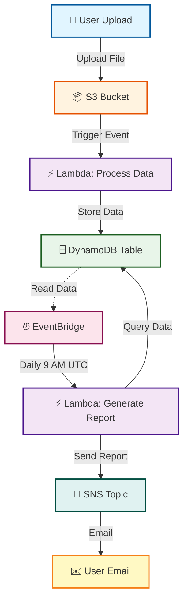

# 🚀 Event-Driven Data Processing Pipeline

[](https://aws.amazon.com/)
[](https://www.terraform.io/)
[](https://www.python.org/)
[](LICENSE)

> An automated, serverless data processing pipeline built on AWS that captures incoming data, processes it in real-time, and generates daily summary reports.

---

## 📋 Table of Contents
- [Overview](#-overview)
- [Architecture](#-architecture)
- [Features](#-features)
- [Technologies](#-technologies)
- [Prerequisites](#-prerequisites)
- [Installation](#-installation)
- [Usage](#-usage)
- [Project Structure](#-project-structure)
- [Testing](#-testing)
- [Cleanup](#-cleanup)

---

## 🎯 Overview

This project demonstrates a **fully automated event-driven architecture** on AWS that:
- ✅ Automatically processes data files uploaded to S3
- ✅ Stores processed data in DynamoDB
- ✅ Generates daily summary reports
- ✅ Sends notifications via SNS
- ✅ Uses Infrastructure as Code (Terraform)
- ✅ Implements CI/CD best practices

---

## 🏗️ Architecture


### Interactive Architecture Diagram



### Architecture Flow:

```
┌─────────┐      ┌─────────┐      ┌──────────────┐      ┌──────────────┐
│  User   │─────▶│   S3    │─────▶│   Lambda     │─────▶│  DynamoDB    │
│ Upload  │      │ Bucket  │      │  (Process)   │      │   Table      │
└─────────┘      └─────────┘      └──────────────┘      └──────────────┘
                                           │
                                           │
                                           ▼
                 ┌──────────────┐      ┌──────────────┐      ┌─────────┐
                 │ EventBridge  │─────▶│   Lambda     │─────▶│   SNS   │
                 │ (Daily 9AM)  │      │  (Report)    │      │  Email  │
                 └──────────────┘      └──────────────┘      └─────────┘
```

**Flow:**
1. User uploads data file to S3 bucket
2. S3 event triggers Lambda function
3. Lambda processes data and stores in DynamoDB
4. EventBridge triggers report Lambda daily at 9 AM UTC
5. Report Lambda generates summary and sends via SNS

---

## ✨ Features

- 🔄 **Event-Driven**: Automatic processing on file upload
- ⚡ **Serverless**: No server management required
- 📊 **Automated Reports**: Daily summaries generated automatically
- 💰 **Cost-Effective**: Uses AWS Free Tier services
- 🔧 **Infrastructure as Code**: Fully automated deployment with Terraform
- 🔒 **Secure**: IAM roles with least privilege access
- 📈 **Scalable**: Auto-scales with demand
- 🔍 **Monitored**: CloudWatch logs for debugging

---

## 🛠️ Technologies

| Technology | Purpose |
|------------|----------|
| **AWS Lambda** | Serverless compute for data processing |
| **Amazon S3** | Object storage for incoming data |
| **DynamoDB** | NoSQL database for processed data |
| **EventBridge** | Scheduled daily report generation |
| **SNS** | Email notifications |
| **Terraform** | Infrastructure as Code |
| **Python 3.9** | Lambda function runtime |
| **GitHub Actions** | CI/CD pipeline |

---

## 📦 Prerequisites

Before you begin, ensure you have:

- ✅ AWS Account ([Create Free Account](https://aws.amazon.com/free/))
- ✅ AWS CLI installed and configured
- ✅ Terraform >= 1.0 installed
- ✅ Python 3.9+ installed
- ✅ Git installed

---

## 🚀 Installation

### Step 1: Clone the Repository

```bash
git clone https://github.com/tanikush/Event-driven-pipeline-complete.git
cd Event-driven-pipeline-complete
```

### Step 2: Configure AWS Credentials

```bash
aws configure
```

Enter your:
- AWS Access Key ID
- AWS Secret Access Key
- Default region: `us-east-1`
- Output format: `json`

### Step 3: Package Lambda Functions

```bash
cd src
zip ../infrastructure/process_data.zip process_data.py
zip ../infrastructure/generate_report.zip generate_report.py
cd ..
```

### Step 4: Deploy Infrastructure

```bash
cd infrastructure
terraform init
terraform plan
terraform apply
```

Type `yes` when prompted.

---

## 📖 Usage

### Upload Test Data

```bash
aws s3 cp test-data.json s3://YOUR-BUCKET-NAME/
```

### View Lambda Logs

```bash
aws logs tail /aws/lambda/ProcessDataFunction --follow
```

### Check Processed Data

```bash
aws dynamodb scan --table-name ProcessedData
```

### Subscribe to Email Reports

```bash
aws sns subscribe \
  --topic-arn YOUR-SNS-TOPIC-ARN \
  --protocol email \
  --notification-endpoint your-email@example.com
```

Confirm subscription in your email.

### Manually Trigger Report

```bash
aws lambda invoke --function-name GenerateReportFunction response.json
```

---

## 📁 Project Structure

```
Event-driven-pipeline-complete/
├── infrastructure/
│   ├── main.tf              # Terraform configuration
│   ├── process_data.zip     # Lambda deployment package
│   └── generate_report.zip  # Lambda deployment package
├── src/
│   ├── process_data.py      # Data processing Lambda
│   └── generate_report.py   # Report generation Lambda
├── .gitignore               # Git ignore rules
├── test-data.json           # Sample test data
└── README.md                # This file
```

---

## 🧪 Testing

### Test Data Processing

1. Upload test file:
   ```bash
   aws s3 cp test-data.json s3://event-pipeline-data-XXXXX/
   ```

2. Verify in DynamoDB:
   ```bash
   aws dynamodb scan --table-name ProcessedData
   ```

3. Check logs:
   ```bash
   aws logs tail /aws/lambda/ProcessDataFunction
   ```

### Test Report Generation

```bash
aws lambda invoke --function-name GenerateReportFunction output.json
cat output.json
```

---

## 🧹 Cleanup

To avoid AWS charges, destroy all resources:

```bash
cd infrastructure
terraform destroy
```

Type `yes` when prompted.

This will delete:
- S3 bucket and contents
- Lambda functions
- DynamoDB table
- SNS topic
- EventBridge rules
- IAM roles

---

## 📊 AWS Resources Created

| Resource | Name | Purpose |
|----------|------|----------|
| S3 Bucket | `event-pipeline-data-*` | Data storage |
| Lambda | `ProcessDataFunction` | Process incoming data |
| Lambda | `GenerateReportFunction` | Generate daily reports |
| DynamoDB | `ProcessedData` | Store processed records |
| SNS Topic | `daily-report` | Email notifications |
| EventBridge | `daily-report-schedule` | Daily trigger at 9 AM |
| IAM Role | `lambda_execution_role` | Lambda permissions |

---

## 💰 Cost Estimation

**All services used are within AWS Free Tier:**

- Lambda: 1M requests/month (Free)
- S3: 5GB storage (Free)
- DynamoDB: 25GB storage (Free)
- SNS: 1,000 emails/month (Free)
- EventBridge: Always free

**Estimated Monthly Cost: $0.00** ✅

---

## 🔒 Security Best Practices

- ✅ IAM roles with least privilege
- ✅ No hardcoded credentials
- ✅ Encrypted data at rest (S3, DynamoDB)
- ✅ CloudWatch logging enabled
- ✅ VPC endpoints (optional enhancement)

---

## 🤝 Contributing

Contributions are welcome! Please:
1. Fork the repository
2. Create a feature branch
3. Commit your changes
4. Push to the branch
5. Open a Pull Request

---

## 📝 License

This project is licensed under the MIT License.

---

## 👤 Author

**Tanisha Kushwah**
- GitHub: [@tanikush](https://github.com/tanikush)

---

## 🙏 Acknowledgments

- AWS Documentation
- Terraform Documentation
- DevOps Community

---

## 📞 Support

If you have questions or issues:
- Open an [Issue](https://github.com/tanikush/Event-driven-pipeline-complete/issues)
- Check [AWS Documentation](https://docs.aws.amazon.com/)

---

⭐ **If you found this project helpful, please give it a star!** ⭐
